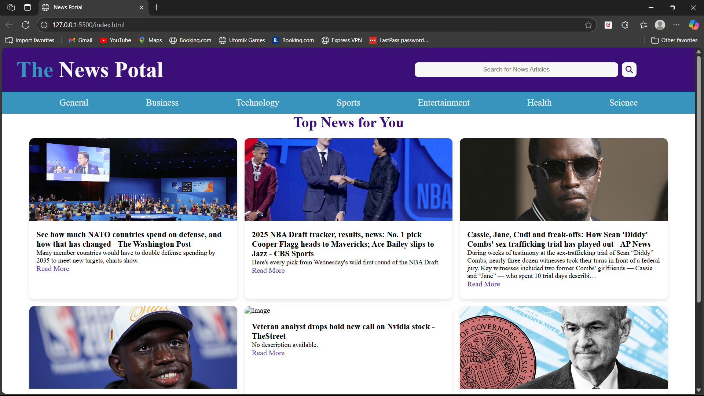
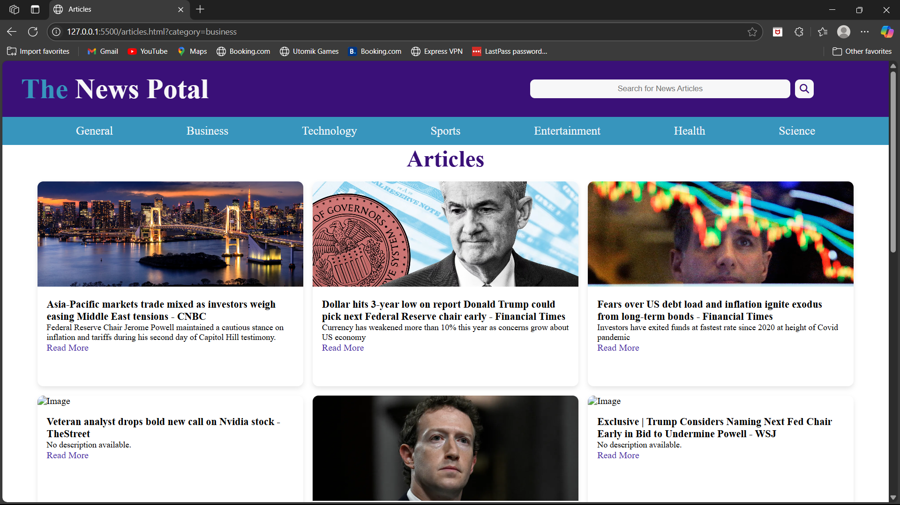

# 📰 NewsPortal

**NewsPortal** is a dynamic and user-friendly news website built with HTML, CSS, and JavaScript. It presents top headlines from various categories like Business, Technology, Sports, and Entertainment by integrating with the NewsAPI.

## 🚀 Features

- 📱 Responsive design for mobile and desktop
- 🗂️ Categorized news sections (Business, Sports, Technology, etc.)
- 🔍 Search functionality for custom news queries
- 📰 Fetches real-time news using NewsAPI
- 🌐 Clean and intuitive UI for easy navigation

## 📸 Screenshots

<!-- Add your own screenshots in a /screenshots folder -->

## 🛠️ Tech Stack

- **Frontend:** HTML, CSS, JavaScript
- **API:** [NewsAPI.org](https://newsapi.org/)
